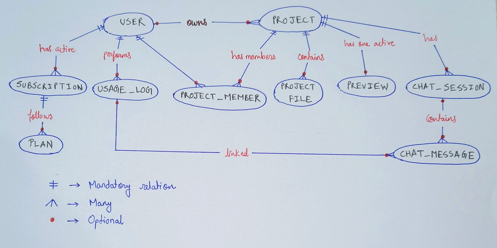
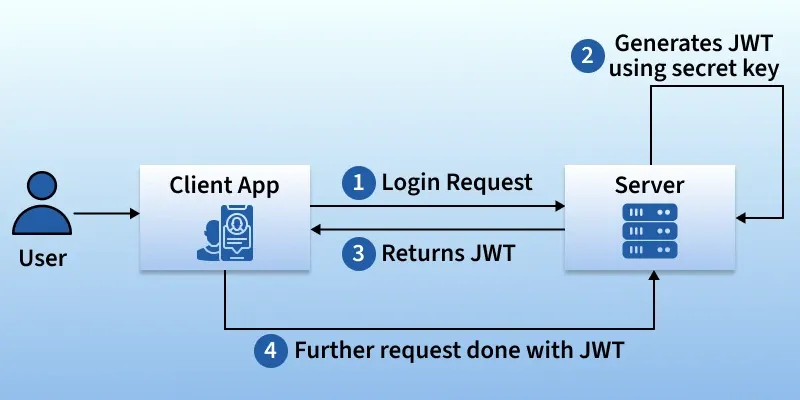
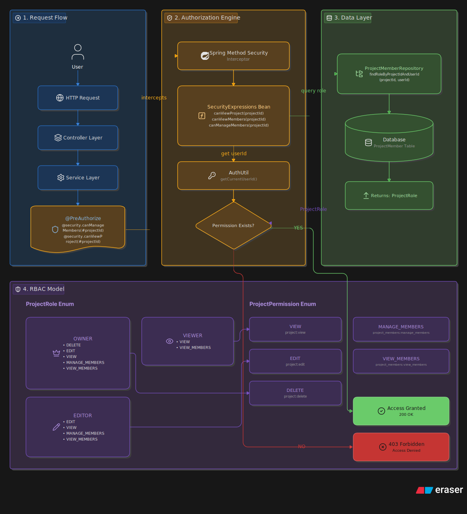

# 🚀 AI based Code Generator Platform

Production-oriented backend system built using **Spring Boot 4** and **Java 17** for AI-assisted code generation (vibe coding platform).

---

## 📖 Overview

This Spring Boot application helps in generating code files/projects based on prompts provided by the user.

---

## 🛠️ Tech Stack

- ☕ Java 17
- 🌱 Spring Boot 4
- 🔐 Spring Security
- 🗄️ Spring Data JPA
- 🐘 PostgreSQL
- 🤖 Spring AI + OpenAI
- 🔄 MapStruct
- ⚡ Redis
- 🐳 Docker
- ☸️ Kubernetes
- 📦 MinIO
- 💳 Stripe

---

## ✨ Features

- 🔐 JWT Authentication & Authorization
- 👤 User & Workspace Management
- 📂 Project & Template Management
- 🤖 AI Code Generation APIs
- 📁 File Upload & Storage with MinIO
- 💳 Subscription Billing with Stripe
- ⚡ Redis Caching
- ☸️ Kubernetes Deployment

---

## 🏗️ Architecture

Layered Architecture:

```text
Controller → Service → Repository → Database
```

### Additional Integrations

- 🤖 OpenAI for AI-assisted workflows
- 📦 MinIO for object/file storage
- 💳 Stripe for billing/subscriptions
- ⚡ Redis for caching


## 🗄️ Database Design



---

## 🔑 Authentication using JWT



---

## 🪪 Authorization



---

## 📁 Repository Structure

```bash
src/
 ├── main/
 │   ├── java/
 │   │   └── com.springboot.AI_Code_Generator/
 │   │       ├── config/        # Confguration files
 │   │       ├── controller/    # REST Controllers
 │   │       ├── dto/           # Request & Response DTOs
 │   │       ├── entity/        # JPA Entities
 │   │       ├── enums/         # Enum Definitions
 │   │       ├── mapper/        # MapStruct Mappers
 │   │       ├── repository/    # Spring Data JPA Repositories
 │   │       ├── service/       # Business Logic Layer
 │   │       ├── error/         # Custom exception handlers
 │   │       ├── security/      # Authetication, Authorization, JWT
 │   │       └── AiCodeGeneratorApplication.java
 │   │
 │   └── resources/
 │       ├── static/
 │       ├── templates/
 │       └── application.yaml
 │
 └── test/
```

---

## 🔌 API Modules

### 📂 Project API Endpoints

| Method | Endpoint | Description | Requires authentication? |
|--------|----------|-------------|--------------------------|
| GET | `/api/project` | Retrieve all projects for a user | Yes |
| GET | `/api/project/{id}` | Retrieve project using ID | Yes |
| POST | `/api/project` | Create a new project | Yes |
| PATCH | `/api/project/{id}` | Update project details | Yes |
| DELETE | `/api/project/{id}` | Soft delete a project | Yes |

---

### 👥 Project Member API Endpoints

| Method | Endpoint | Description | Requires authentication? |
|--------|----------|-------------|--------------------------|
| GET | `/api/projects/{projectId}/members` | Retrieve all members associated with a project | Yes |
| POST | `/api/projects/{projectId}/members` | Invite a user to join the project | Yes |
| PATCH | `/api/projects/{projectId}/members/{memberId}` | Update a member's role in the project | Yes |
| DELETE | `/api/projects/{projectId}/members/{memberId}` | Remove a member from the project | Yes |

---

### 🔒 Auth API Endpoints

| Method | Endpoint | Description | Requires authentication? |
|--------|----------|-------------|--------------------------|
| POST | `/api/auth/signup` | New user signup | No |
| POST | `/api/auth/signup` | User login, return JWT token if user is authenticated successfully | No |

---

### 💵 Billing API Endpoints

| Method | Endpoint | Description | Requires authentication? |
|--------|----------|-------------|--------------------------|
| POST | `/api/payments/checkout` | Generates Stripe checkout session | Yes |
| POST | `/api/payments/portal` | Open Stripe customer portal | Yes |

---
```bash
# More endpoints will be added as the development progresses.
```
---

## 🎯 Learning Goals

This project is focused on understanding:

- 🏗️ Production-ready backend architecture
- 🔐 Secure API design
- 🤖 AI-assisted development workflows
- ☁️ Distributed/cloud-native deployment concepts
- ⚡ Scalable database and caching strategies

---

## 🚀 Future Improvements

- 🔄 CI/CD Pipeline
- 📊 Monitoring & Logging
- 🚦 Rate Limiting
- 📡 Event-Driven Architecture
- 🧩 Microservices Exploration

---

## ▶️ Running the Project

```bash
# Coming Soon
```

---

## 📌 Project Status

Current Progress:

- ✅ Feature Planning
- ✅ API Planning
- ✅ Database Modeling
- ✅ Project APIs
- ✅ Project Member APIs
- ✅ Authentication with JWT
- ✅ Authorization (Granular)
- ✅ Stripe payment gateway integration

---

## 📜 License

This project is intended for learning and educational purposes.
